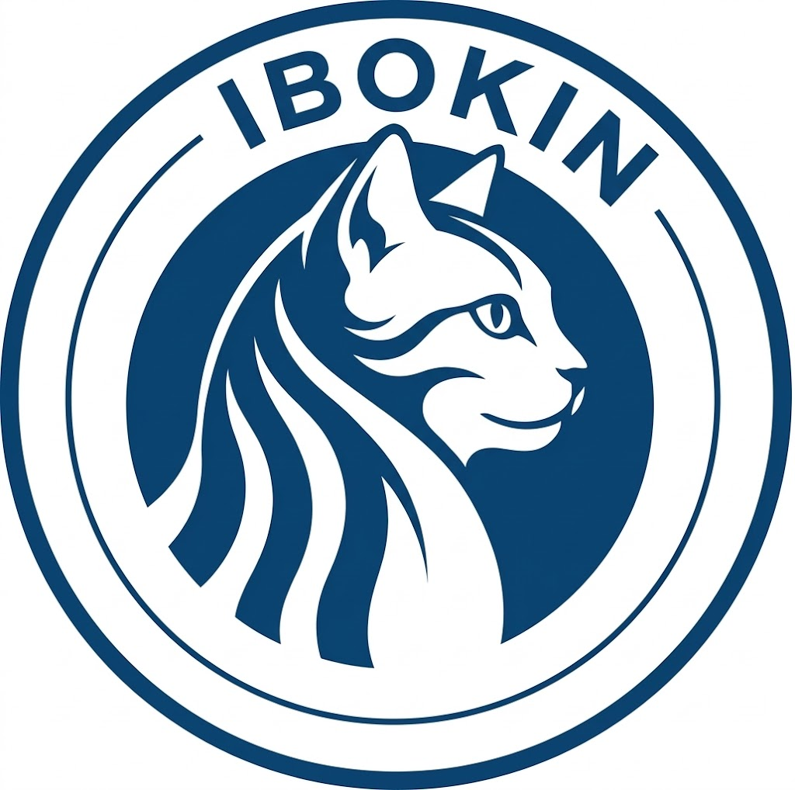

# IBOKIN — nieoficjalna integracja IBOK Infrastruktury Niepołomice dla Home Assistant

<p align="center">
  
</p>

**IBOKIN** pobiera dane z Internetowego Biura Obsługi [ibok.infrastruktura.eu](https://ibok.infrastruktura.eu/) (woda i ścieki, Infrastruktura Niepołomice sp. z o.o.) i udostępnia je jako sensory Home Assistant.

> **IBOKIN jest integracją nieoficjalną**, tworzoną niezależnie od operatora. Logowanie odbywa się Twoimi danymi z IBO, które przechowuje Home Assistant. Projekt nie jest powiązany z Infrastrukturą Niepołomice sp. z o.o. Jeśli wdrożenie IBO w Twojej gminie ma inną domenę/inną strukturę stron — ta wersja może wymagać adaptacji.

## Funkcje

| Sensor | Opis |
|---|---|
| `sensor.ibokin_saldo_niezaplaconych` | Suma niezapłaconych płatności (PLN). Atrybuty: liczba dokumentów, przeterminowane, najbliższy termin, nadpłata, lista faktur (nr, termin, kwota, pozostało). |
| `sensor.ibokin_ostatni_odczyt_wody` | Ostatni odczyt wodomierza (m³). Atrybuty: data, typ odczytu (radiowy/IBOK), poprzedni odczyt, zużycie, pełna historia. |

Odświeżanie co **12 h** (każde odświeżenie = jedno logowanie do IBO). Przy wygaśnięciu sesji IBOKIN loguje się ponownie automatycznie.

## Instalacja (HACS)

1. HACS → **Integrations** → menu (⋮) → **Custom repositories**
2. Wklej adres tego repozytorium, kategoria: **Integration**
3. Kliknij **Download**
4. Uruchom ponownie Home Assistant (wymagane — bez restartu konfigurator się nie pojawi)

## Konfiguracja

1. **Ustawienia → Urządzenia i usługi → Dodaj integrację → IBOKIN — IBO Niepołomice**
2. Podaj:
   - **Numer klienta** (lub e-mail — ten, którego używasz na IBO)
   - **Hasło**
   - **ID licznika** — liczba z adresu strony historii odczytów: `HistoriaOdczytu.aspx?id=10054` → `10054` (domyślne)

## Automatyzacja — przykład (przypomnienie o zaległej fakturze)

```yaml
automation:
  - alias: "IBOKIN: przypomnienie o przeterminowanej fakturze"
    triggers:
      - trigger: numeric_state
        entity_id: sensor.ibokin_saldo_niezaplaconych
        above: 0
    conditions:
      - condition: numeric_state
        entity_id: sensor.ibokin_saldo_niezaplaconych
        attribute: przeterminowane
        above: 0
    actions:
      - action: notify.persistent_notification
        data:
          title: "IBOKIN: zaległa faktura"
          message: >
            Saldo {{ states('sensor.ibokin_saldo_niezaplaconych') }} PLN,
            najbliższy termin:
            {{ state_attr('sensor.ibokin_saldo_niezaplaconych', 'najblizszy_termin') }}.
```

## Rozwiązywanie problemów

- **`invalid_auth`** — sprawdź w przeglądarce, czy logujesz się tym samym numerem/e-mailem i hasłem. Kilka nieudanych prób może tymczasowo zablokować konto IBO.
- **`cannot_connect`** — strona IBO niedostępna lub zmieniona (IBOKIN parsuje HTML — zmiana układu stron IBO wymaga aktualizacji).
- **`Invalid handler specified` / `Platform ibokin.config_flow not found` przy dodawaniu integracji** — brak restartu HA po instalacji HACS albo stare pliki starej wersji w `config/custom_components/`. Zrestartuj HA; jeśli nie pomoże — usuń folder `custom_components/ibokin`, zainstaluj ponownie przez HACS i zrestartuj.
- Sensor `unavailable` po zmianie strony IBO — zgłoś issue; struktura tabel DevExpress bywa zmieniana.

## Licencja

MIT
